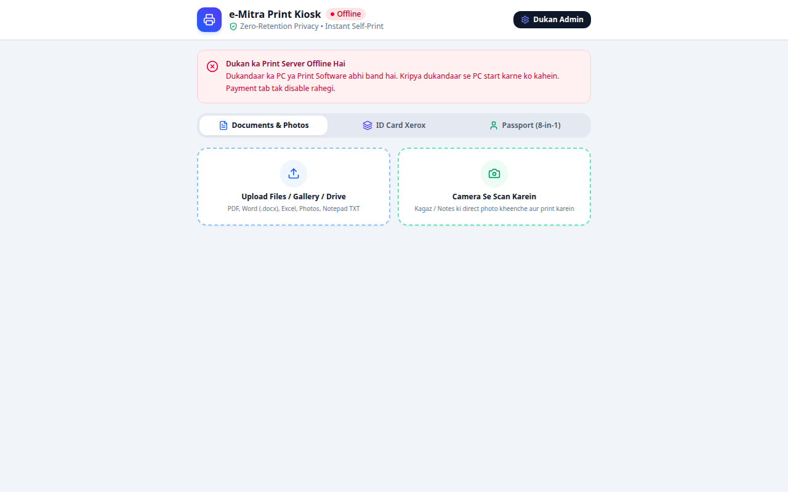

<div align="center">

# 🏛️ eMitra Citizen Kiosk & Digital Services Platform

**Multi-Tenant Government & Citizen Service Kiosk Backend with Razorpay Payments, QR Code Billing & PDF Document Processing**

[](https://nodejs.org)
[](https://expressjs.com)
[](https://razorpay.com)
[](https://docker.com)
[](LICENSE)

[⭐ Star This Repo](https://github.com/pixelssudio/emitra-kiosk-portal) • [Report Issue](https://github.com/pixelssudio/emitra-kiosk-portal/issues)

</div>


<div align="center">
  <br/>
  
  <br/>
</div>

---


## ⚡ Overview

A full-featured digital service center and e-Governance kiosk backend tailored for multi-service cyber cafes, CSC centers, and eMitra stores.

Supports citizen utility bill payments, certificate and document uploads, automated high-compression PDF generation (`pdf-lib`, `sharp`), dynamic UPI QR code payments, and live kiosk order tracking.

---

## ✨ Features

- 💳 **Integrated Payments:** Dynamic Razorpay order creation and webhook verification for automated receipting.
- 📱 **QR Code Generation:** Instant on-screen UPI QR codes (`qrcode`) for contactless customer payments.
- 📄 **Document & Photo Suite:** High-speed server-side image optimization, HEIC to JPEG conversion, and multi-page PDF generation.
- 🏢 **Multi-Shop Management:** Manage shop inventories, operator roles, fee margins, and daily transaction journals.
- 🐳 **Dockerized Deployment:** Production Dockerfile and docker-compose configurations ready for single-command deployment.

---

## 🚀 Quick Start

```bash
git clone https://github.com/pixelssudio/emitra-kiosk-portal.git
cd emitra-kiosk-portal
npm install
cp .env.example .env
npm start
```
Default server starts on `http://localhost:4000`.

---

## 👨‍💻 Author

**The Musafir (@pixelssudio)**  
- 💼 GitHub: [github.com/pixelssudio](https://github.com/pixelssudio)  
- 💬 Telegram: [@the_musafir](https://t.me/the_musafir)  
